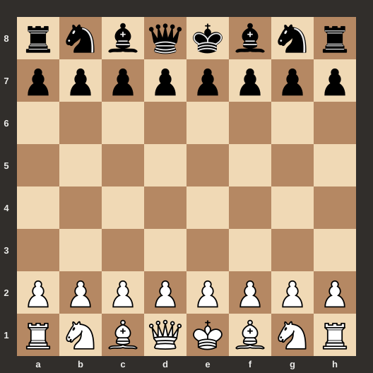

# ♟️ Desafio Xadrez

Jogo de xadrez para dois jogadores no navegador, feito **somente com HTML, CSS e JavaScript** (sem frameworks e sem bibliotecas). As regras são implementadas em JavaScript: uma jogada inválida é rejeitada pela lógica do programa, e não apenas escondida pela interface.


Projeto da disciplina **Desenvolvimento Web** (Análise e Desenvolvimento de Sistemas, Faculdade Uniguaçu).

<p align="center">
  
</p>

> Jogue online: `https://gabrielbarbosafeijo-cpu.github.io/Xadrez-compartilhado/` (disponível depois de ativar o GitHub Pages; veja a seção [Publicar online](#publicar-online)).

## Sumário

- [Funcionalidades](#funcionalidades)
- [Como jogar](#como-jogar)
- [Como executar](#como-executar)
- [Estrutura do projeto](#estrutura-do-projeto)
- [Como funciona](#como-funciona)
- [Testes](#testes)
- [Publicar online](#publicar-online)
- [Limitações](#limitações)
- [Créditos](#créditos)
- [Licença](#licença)

## Funcionalidades

**Requisitos do desafio**

- [x] Tabuleiro 8×8 responsivo, com coordenadas (a–h e 1–8) e casas alternadas
- [x] Peças em SVG, na posição inicial oficial
- [x] Estado do jogo em uma matriz JavaScript, com a tela redesenhada a partir dela
- [x] Drag and Drop com destaque da peça arrastada
- [x] Alternância de turnos com indicação do jogador atual
- [x] Movimento correto de todas as peças, sem atravessar outras peças
- [x] Captura, e proibição de capturar peça da mesma cor
- [x] Validação por JavaScript: peça do adversário, origem vazia, destino inválido
- [x] Xeque, com destaque do rei ameaçado
- [x] Proibição de deixar o próprio rei em xeque (inclui peças cravadas)
- [x] Xeque-mate e empate por afogamento
- [x] Promoção do peão (dama, torre, bispo ou cavalo)
- [x] Botão **Nova partida**

**Extras**

- [x] **Roque** pequeno e grande, com todas as restrições
- [x] **En passant**
- [x] **Histórico** em notação algébrica (`e4`, `Nf3`, `exd5`, `O-O`, `e8=Q+`, `Qh4#`)
- [x] Destaque da última jogada e das casas de destino possíveis durante o arrasto
- [x] Testes automatizados das regras e da interface

## Como jogar

1. As brancas começam. Arraste uma peça e solte na casa de destino.
2. Enquanto você arrasta, as casas permitidas aparecem marcadas (bolinha para casa livre, anel para captura).
3. Se a jogada não for permitida, a peça volta ao lugar e um aviso explica o motivo.
4. Ao levar um peão até a última fileira, escolha a peça da promoção no menu.
5. O jogo avisa o xeque, o xeque-mate e o afogamento. Use **Nova partida** para recomeçar.

## Como executar

Não precisa instalar nada nem abrir servidor:

```bash
git clone https://github.com/gabrielbarbosafeijo-cpu/Xadrez-compartilhado.git
cd Xadrez-compartilhado
```

Depois, dê um duplo clique em `index.html` (ou abra o arquivo no navegador).

## Estrutura do projeto

```text
Xadrez-compartilhado/
├── index.html
├── css/
│   └── style.css          # layout, tabuleiro, destaques e responsividade
├── js/
│   ├── pieces.js          # códigos das peças, cores, imagens e posição inicial
│   ├── rules.js           # regras do xadrez (lógica pura, sem tocar na tela)
│   ├── board.js           # desenho do tabuleiro, painel e Drag and Drop
│   ├── game.js            # estado da partida, turnos e fluxo de uma jogada
│   └── main.js            # ponto de partida
├── assets/chess/          # 12 SVGs das peças (+ CREDITOS.md)
├── tests/
│   ├── perft.js           # valida as regras contra números oficiais
│   └── ui.js              # simula partidas arrastando peças
├── docs/
│   ├── ARQUITETURA.md     # explicação detalhada do código
│   └── preview.svg
└── .github/workflows/     # testes automáticos a cada push
```

A ordem dos `<script>` no `index.html` importa: cada arquivo usa funções dos anteriores.

## Como funciona

**O estado** fica em variáveis de `game.js`: `tabuleiro` (matriz 8×8 com códigos como `"wK"` e `"bP"`), `jogadorAtual`, `contexto` (direitos de roque e alvo de *en passant*), `historico` e `situacaoPartida`. A tela é só um desenho desse estado: toda jogada altera a matriz e depois chama `renderizarTabuleiro()`.

**Uma jogada** nunca é executada pelo evento `drop`. Ele só descobre a origem e o destino e chama `tentarJogada()`, que pergunta a `jogadaEhValida()` (em `rules.js`) se a jogada vale. Só então o estado é alterado e o turno troca.

**A validação** confere, na ordem: peça na origem, peça do jogador da vez, destino diferente da origem, destino sem peça da mesma cor, movimento permitido para aquela peça (com caminho livre) e, por fim, se o próprio rei não ficaria em xeque. Essa última etapa **simula a jogada numa cópia do tabuleiro**, o que resolve peças cravadas, rei andando para casa atacada e a obrigação de sair do xeque com uma única verificação.

**Fim de jogo:** depois de cada jogada, o programa confere se o próximo jogador tem alguma jogada legal. Sem jogada e em xeque é xeque-mate; sem jogada e fora de xeque é afogamento.

Mais detalhes em [`docs/ARQUITETURA.md`](docs/ARQUITETURA.md).

## Testes

As regras foram validadas com o teste **perft**: o programa conta todas as sequências de jogadas possíveis a partir de 5 posições clássicas e compara com os números oficiais do [Chess Programming Wiki](https://www.chessprogramming.org/Perft_Results). Isso cobre roque, en passant, promoção e peças cravadas.

```bash
npm install          # só para os testes de interface (instala o jsdom)
npm test             # roda tudo
npm run test:regras  # só as regras (não precisa de npm install)
```

Os testes de interface simulam partidas arrastando peças (xeque-mate do louco, roque, en passant, promoção, afogamento, jogadas inválidas).

## Publicar online

Como o projeto é só HTML, CSS e JS, o GitHub Pages serve direto: em **Settings → Pages**, escolha **Deploy from a branch**, branch `main`, pasta `/ (root)`. Depois de alguns minutos o jogo fica em `https://gabrielbarbosafeijo-cpu.github.io/Xadrez-compartilhado/`.

## Limitações

- Não há suporte a toque (celular), pois o Drag and Drop nativo do HTML foi o escolhido para este desafio
- Não foram implementados outros empates: material insuficiente, repetição de posição e regra dos 50 lances
- É um jogo para duas pessoas no mesmo computador (não há computador adversário nem partida online)

## Créditos

- **Peças:** conjunto *cburnett* de [Colin M. L. Burnett](https://en.wikipedia.org/wiki/User:Cburnett), distribuído pelo [Lichess](https://github.com/lichess-org/lila/tree/master/public/piece/cburnett) sob a licença GPLv2+. Detalhes em [`assets/chess/CREDITOS.md`](assets/chess/CREDITOS.md).
- **Validação das regras:** números do [Perft Results](https://www.chessprogramming.org/Perft_Results).
- **Desenvolvimento:** Gabriel, com auxílio do Claude (Anthropic) na escrita e revisão do código.

## Licença

Código sob a licença [MIT](LICENSE). As imagens das peças seguem a licença indicada em Créditos.
